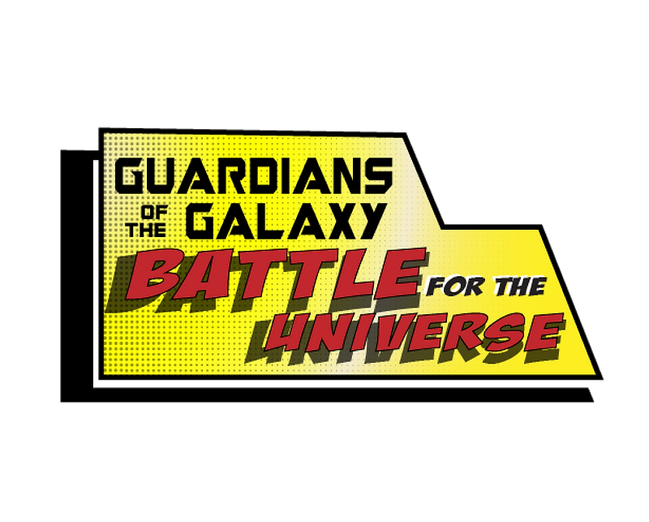
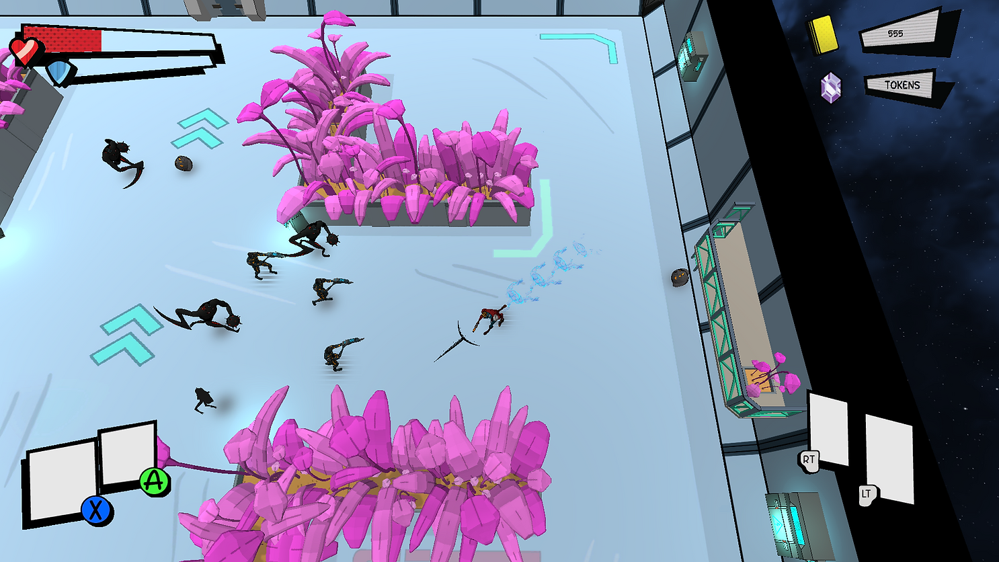
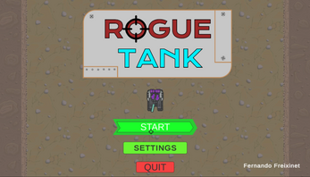
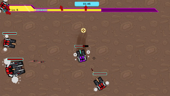
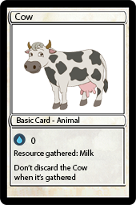
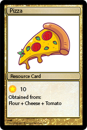

# Fernando Freixinet
I'm Fernando Freixinet from Barcelona, I'm 21 years old and here you will find some information about me and my projects.

Videogames have always been a part of my life and I'm really interested in their design.
I know how to develop games using C++/C# and use game engines like Unity which I think could be very useful as a designer.
I love learning new things, I'm an organized person and I can easily adapt to the different necessities of the teams or the projects I'm working on.

# Education
I'm a videogame development student from the UPC (Universitat Politècnica de Catalunya),
currently studying on my last year of the degree. 
The degree I'm studying is teached entirely in einglish and its official name is "Grau en Disseny i Desenvolupament de Videojocs".

# Experience
I have more than one year of experience as a Unity Engine teacher at LifeCole, where I have to desing the diferent exercises
for the students and develop several educational projects. I teach the use of game engines and coding from the basics to the creation of finnished videogames.

# My Projects
## Guardians of the Galaxy: Battle for the Universe

This is the final project of the third year of the videogame development degree, where I was the lead designer. 
Guardians of the Galaxy: Battle for the Universe is a 3D top-down shooter roguelite set in the Guardians of the Galaxy universe,
made in collaboration with the whole class using our own game engine built from scratch.

You can check:

[The webpage of the game](https://pixelplaygroundgam.wixsite.com/pixelplayground/the-studio)

[The GitHub repository](https://github.com/rastabrandy02/Guardians_of_the_Galaxy_Battle_for_the_Universe)

[The Game Design Document](https://drive.google.com/file/d/1FHXnxEN5LNQL6NPZ3jDBR5BZy6xLFWRd/view?usp=sharing)

## Rogue Tank

Rogue Tank is a top-down shooter roguelite based on surviving enemy waves while leveling up and getting stronger 
I designed and developed this game by myself using Unity.

[You can check my game here](https://rastabrandy02.itch.io/rogue-tank)

## Growing Madness

Growing Madness is the board game I have designed, based on a competitive approach of classic farming games.
This board game has all the material, rules and documentation ready to print and start playing.

[You can see all the Growing Madness material here](https://drive.google.com/drive/folders/1fc6CwOr-I5MDVTDa4zxrZPjk5qLMA_9M?usp=drive_link)

# Contact Me

E-mail: nofer02@gmail.com

[CV](https://drive.google.com/file/d/1AUYLbDF1QRkkeKZr3jgqcudwg48fmR_2/view?usp=sharing)

[Linkedin](https://www.linkedin.com/in/fernando-freixinet-677847279/)

[GitHub](https://github.com/rastabrandy02)
